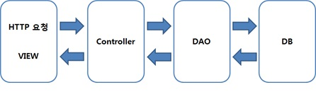
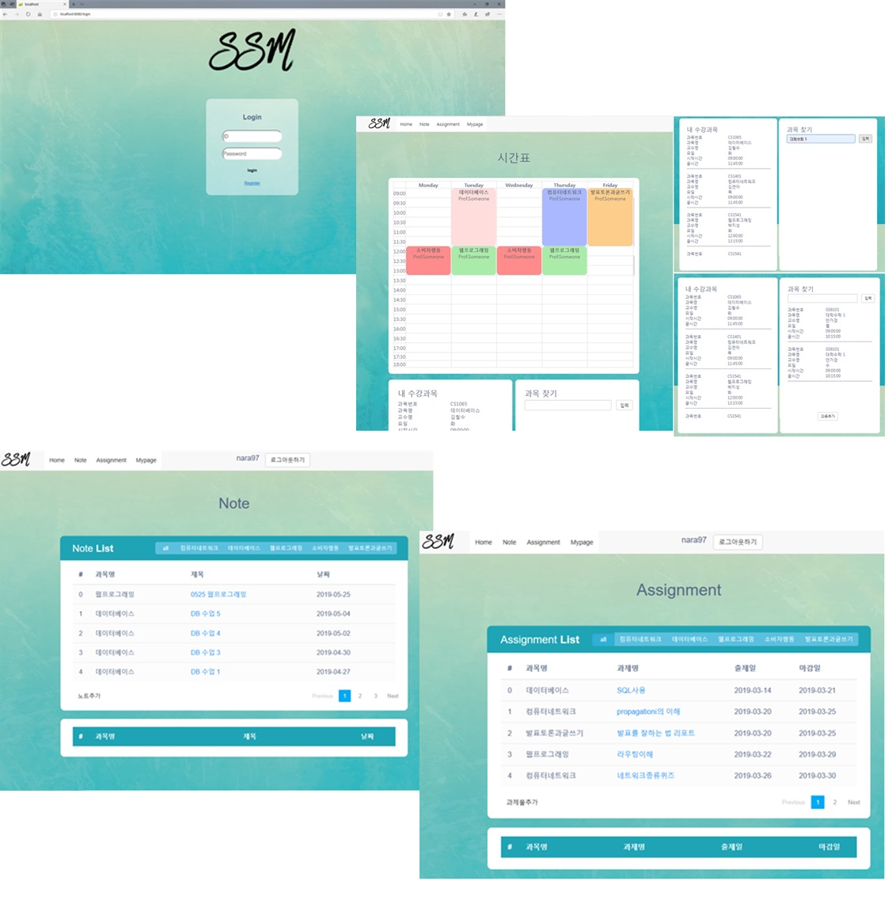
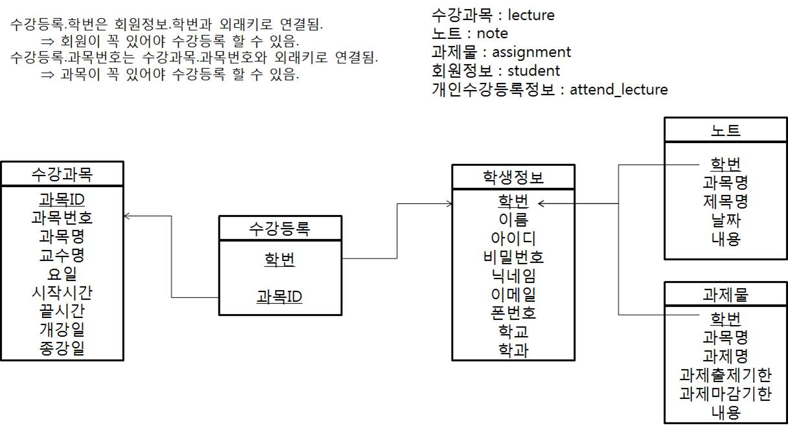
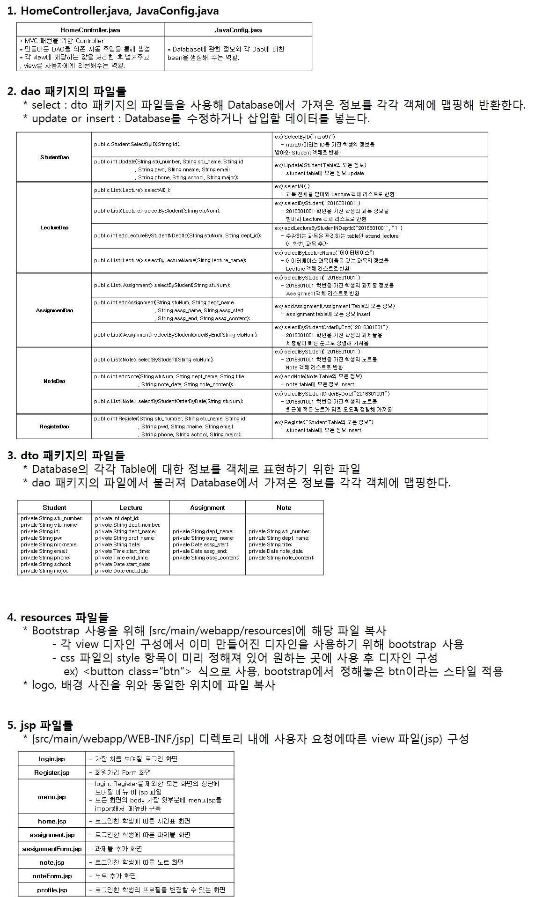

# SpringWebProject2019

# 기간
    2개월 (2019-04-19 ~ 2019-06-15)
    
    
    
# 개요
    Spring Framework의 미니 프로젝트로 학생의 수업을 관리하고, 과제물과 노트 등의 
    필기를 할 수 있는 게시판이 있는 웹 사이트를 구현했습니다.
    
    
    
# 사용한 라이브러리 및 구현 환경
    1. 구현 환경
        - Window 7
        - Java
        - Spring framework (SpringToolSuite4)
        - JSP
        - MySQL
        
    2. 사용한 라이브러리 및 기능
        - Spring Boot
        - Bootstrap을 사용해 UI 개선
        - Trello를 사용한 프로젝트 관리
        - MVC 패턴 사용
        
        
        
# 필요 기능과 과정
    1. 필요한 페이지
        - 수강하는 과목 시간표 출력
        - 노트, 과제물 게시판
        - 회원정보 페이지 (마이페이지)
        
    2. MVC 패턴, DI 사용
        - DAO, DTO 생성해 데이터베이스 접근
        - Controller를 통해 view 접근
        - session을 통한 로그인 제어

    

        
        
        
# 구현 화면
    1. 로그인을 하면 자신이 수강한 과목에 해당하는 시간표가 보여짐
    2. note 및 assignment를 누르면 과목별로 해당하는 게시판으로 이동
        , 본인이 적어놓은 게시글을 볼 수 있음.
    3. Mypage에서 자신의 정보를 변경할 수 있음.

    

  

# 주요 기능
    1. 로그인
        아이디와 비밀번호를 입력한다. 둘 중 하나라도 입력이 안될 시, 입력요구 메시지가 뜨고
        , 등록된 아이디나 비밀번호가 아니라면 로그인 화면이 유지된다.

    2. 회원가입
        로그인 화면에서 ‘Register’ 클릭 시, 회원가입 화면으로 이동한다. ‘*’ 가 붙은 Name, Id, Password, 
        Student Number는 반드시 입력되어야 한다. 입력 사항에 문제가 없다면 Register 버튼을 눌렀을 때 
        로그인 화면으로 넘어가고, 그렇지 않다면 초기화 된 Register 화면이 보인다.

    3. Home
        로고와 기능들이 있는 메뉴바가 상단에 있고, 로그인 된 회원의 아이디를 보여준다. 회원의 시간표를
        weekly로 보여주고, 그 밑에는 회원이 현재 수강하고 있는 ‘내 수강과목’ 과 ‘과목 찾기’ 기능이 있다.
        과목찾기의 검색창에 과목명을 검색하면 그에 해당하는 과목의 정보가 보여진다. ‘과목추가’ 버튼을
        누르면 왼쪽의 ‘내 수강과목’ 목록에 추가되고 상단의 시간표에도 추가된다.

    4. Note
        * 사용자가 필기를 관리할 수 있는 Note 기능이다.
        4-1) Note List
            사용자가 등록해 놓은 노트에 대해 입력 순서를 나타내는 번호와 과목명, 제목, 날짜를 보여준다.
            List에는 ‘all’과 과목명이 쓰여진 버튼들이 있는데 ‘all’일 때는 과목과 상관없이 등록된 순서대로 
            노트들이 나타나고, 과목명의 버튼을 누르면 각 과목명 앞으로 등록되어 있는 노트들이 최신순으로 
            나타난다. 제목을 클릭하면, List 하단에서 해당 노트의 내용을 볼 수 있다.
        4-2) 노트 추가
            List의 왼쪽 하단에 있는 ‘노트추가’ 버튼을 클릭하면 과목명, 제목, 날짜, 내용을 입력할 수 있다. 
            왼쪽 하단의 푸른색의 ‘Add Note’ 버튼을 클릭하면 사용자의 입력 내용이 새롭게 List에 추가된다.

    5. Assignment
        * 사용자가 과제물에 대해 관리할 수 있는 기능이다. 과제물에 대한 일정을 관리할 수 있게 해준다.
        5-1) Assignment List
            사용자가 등록해 놓은 과제물에 대해 입력 순서를 나타내는 번호와 과목명, 제목, 출제일, 마감일
            을 보여준다. ‘all’과 과목명에 대한 버튼은 Note와 같은 방식으로 작동한다. 하지만 노트기능과는 
            달리 마감일이 빠른 순으로 나열해준다. 제목을 클릭하면 과제물에 대한 내용(안내)를 볼 수 있다.
        5-2) ADD Assignment
            List의 왼쪽 하단에 있는 ‘과제물 추기’ 버튼을 클릭하면 과목명, 과제명, 출제일, 마감일, 내용을 
            입력할 수 있다. 왼쪽 하단의 푸른색의 ‘Add Assignment’ 버튼을 클릭하면 사용자의 입력 내용이 
            새롭게 List에 추가된다.

    6. My Page
	    사용자가 회원가입 시 입력했던 정보들을 보여준다. 학번을 제외한 정보는 사용자의 임의로 수정이
	    가능하다. 하단의 ‘update profile’ 버튼을 클릭하면 수정된 정보들이 새롭게 반영된다.
      
    7. 로그아웃
	    메뉴바에서 사용자 ID 옆의 로그아웃 버튼을 클릭하면, 세션이 끊기면서 로그아웃 되고 초기의 로그인 
	    화면으로 돌아간다.
      
      
      
# DB 구조
    * 학생정보(student) : 학번이 기본키로 각 학생당 고유의 학번을 갖고 있다.
    * 수강과목(lecture) : 과목 ID가 기본키로 각 과목별로 추가할때마다 count가 자동으로 증가한다.
    * 수강등록(attend_lecture) : 학번과 과목ID가 외래키로 연결되어 학생 한명당 여러 과목이 들어간다.
    * 노트(note) : 학번이 기본키로 각 학번당 여러 개의 노트를 갖고 있다.
    * 과제물(assignment) : 학번이 기본키로 각 학번당 여러 개의 과제물을 갖고 있다.
    

    

  

# 파일 설명

    

 
